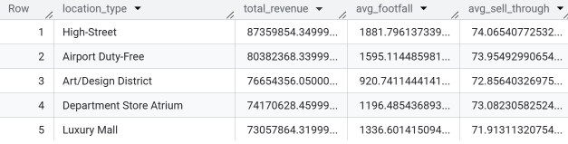
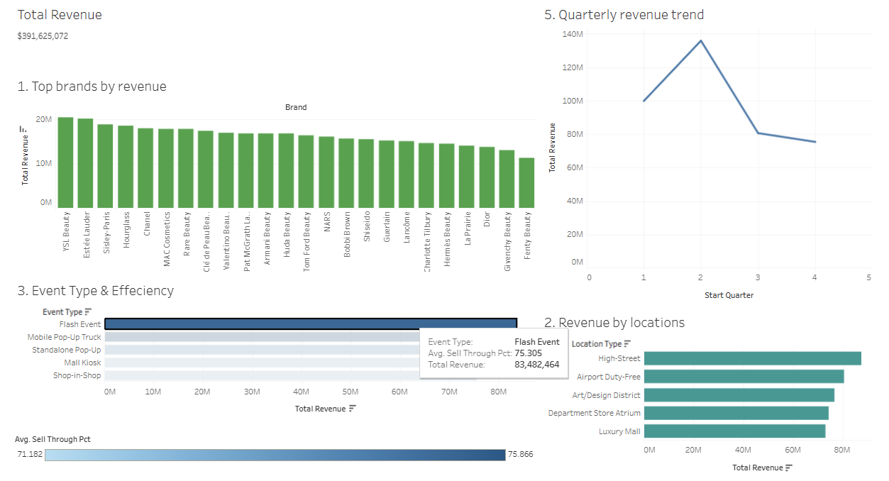

Using SQL (BigQuery) thoughout this analysis and Tableau to display the
visualizations.

## Step 1: ASK

Reporting to the Head of Marketing for a high-end beauty company brand.
Goal: They want to know "What are the key drivers of a successful pop-up
event?"

Key Questions:

-   **Performance**: Which brands and products are the top performers by
    revenue and units sold?

-   **Location**: How do region, city, and location type (e.g., 'Airport
    Duty-Free' vs. 'Luxury Mall') impact sales and footfall?

-   **Strategy**: What is the most effective event type (e.g., 'Flash
    Event', 'Standalone Pop-Up') in terms of revenue and sell-through
    rate?

-   **Efficiency**: Is there a relationship between the
    lease_length_days and the total units_sold?

-   **Seasonal**: Are there specific times of the year (months or
    quarters) that are more successful for pop-ups?

## Step 2: PREPARE

Following these steps to get into the tool - BigQuery:

-   Go to the Google Cloud Console and create a new BigQuery project
    (e.g., Beauty Pop-Up Events 2025).

-   Create a new dataset (e.g., beauty_popups).

-   Inside that dataset, create a new table (e.g.,
    luxury_cosmetics_popups): When creating the table, choose 'Upload'
    as the source, select your luxury_cosmetics_popups.csv file, and let
    BigQuery auto-detect the schema.

We have now "prepared" the data by loading it into our data warehouse.

## Step 3: PROCESS

This is the most critical step: data cleaning and transformation.

### 3.1: Check for duplicates and nulls

```{sql Check for duplicate event_ids}
SELECT
  event_id,
  COUNT(*) AS num_rows
FROM
  beauty-pop-up-events-2025.beauty_popups.luxury_cosmetics_popups
GROUP BY
  event_id
HAVING
  num_rows > 1;
```

There is no duplicated events.

```{sql Check for nulls in key columns}
SELECT
  COUNTIF(city IS NULL) AS missing_city,
  COUNTIF(end_date IS NULL) AS missing_end_date,
  COUNTIF(units_sold IS NULL) AS missing_units_sold
FROM
  `your-project.luxury_popups.events_raw`;
```

47 values are missed in the 'city' column, and missing 36 values in the
'end_date' column.

### 3.2: Create a clean, transformed table.

Handle potential nulls (e.g., fill city with 'Unknown'), and create new
features (like total_revenue).

```{sql This query creates the new, clean table for analysis}
CREATE OR REPLACE TABLE `beauty-pop-up-events-2025.beauty_popups.processed_popups` AS (
  SELECT
    event_id,
    brand,
    region,
    IFNULL(city, 'Unknown') AS city, -- Handle missing cities
    location_type,
    event_type,
    
    -- Columns are already DATE type (since BigQuery auto-detect the schema), just alias them for clarity
    start_date AS clean_start_date,
    end_date AS clean_end_date,
    
    lease_length_days,
    sku,
    product_name,
    price_usd,
    avg_daily_footfall,
    units_sold,
    sell_through_pct,
    
    -- Create new columns
    (price_usd * units_sold) AS total_revenue,
    EXTRACT(MONTH FROM start_date) AS start_month,
    EXTRACT(QUARTER FROM start_date) AS start_quarter
    
  FROM
    beauty-pop-up-events-2025.beauty_popups.luxury_cosmetics_popups
  WHERE
    units_sold > 0 -- Filter out any events with zero sales
    AND end_date IS NOT NULL -- Remove events that don't have an end date
);
```

From now on, we will only use `processed_popups` table for our analysis.

## Step 4: ANALYZE

Now, we answer the "Ask" questions using SQL queries based on the clean
table `processed_popups`.

### 4.1: Determine top 5 brands by total revenue

```{sql Top 5 brands by total revenue}
SELECT
  brand,
  SUM(total_revenue) AS total_revenue
FROM
  beauty-pop-up-events-2025.beauty_popups.processed_popups
GROUP BY
  brand
ORDER BY
  total_revenue DESC
LIMIT 5;
```

Top 5 by revene includes: YSL Beauty, Estée Lauder, Sisley-Paris,
Hourglass, and Chanel.

### 4.2: Address the concern how do location type impact sales and footfall

```{sql How do location types compare}
SELECT
  location_type,
  SUM(total_revenue) AS total_revenue,
  AVG(avg_daily_footfall) AS avg_footfall,
  AVG(sell_through_pct) AS avg_sell_through
FROM
  beauty-pop-up-events-2025.beauty_popups.processed_popups
GROUP BY
  location_type
ORDER BY
  total_revenue DESC;
```

The result is sorted by total revenue:  \###
4.3: Clarify the most effective event types

```{sql What is the most effective event type?}
SELECT
  event_type,
  SUM(total_revenue) AS total_revenue,
  AVG(sell_through_pct) AS avg_sell_through,
  COUNT(event_id) AS number_of_events
FROM
  beauty-pop-up-events-2025.beauty_popups.processed_popups
GROUP BY
  event_type
ORDER BY
  total_revenue DESC;
```

The most effective event types follow the order:

-   Flash Event
-   Mobile Pop-Up Truck
-   Standalone Pop-Up
-   Mall Kiosk
-   Shop-in-Shop

### 4.4: Determine the relationship between the lease duration (lease_length_days) and performance (total units_sold)

```{sql Relationship between lease duration and performance}
SELECT
  -- Grouping the lease lengths into categories
  CASE
    WHEN lease_length_days BETWEEN 1 AND 30 THEN 'Short (1-30 Days)'
    WHEN lease_length_days BETWEEN 31 AND 90 THEN 'Medium (31-90 Days)'
    ELSE 'Long (91+ Days)'
  END AS lease_duration_category,
  
  COUNT(DISTINCT event_id) AS total_events_in_category,
  AVG(units_sold) AS avg_units_sold_per_event,
  AVG(total_revenue) AS avg_revenue_per_event,
  AVG(sell_through_pct) AS avg_sell_through_pct
FROM
  beauty-pop-up-events-2025.beauty_popups.processed_popups
GROUP BY
  lease_duration_category
ORDER BY
  avg_units_sold_per_event DESC;
```

The medium lease duration (31-90 days) has greater average units sold
than the short lease duration (1-30 days).

 \### 4.5: Seasonal
performance

```{sql Seasonal performance (by quarter)}
SELECT
  start_quarter,
  SUM(total_revenue) AS total_revenue
FROM
  beauty-pop-up-events-2025.beauty_popups.processed_popups
GROUP BY
  start_quarter
ORDER BY
  start_quarter;
```

The second quarter has the greatest total revenue, and the fourth has
the least revenue in the year 2025.

## Step 5: SHARE

Using Tableau to demonstrate the visualizations for analysis in **step
#4**



View more details in my [Tableau
Public](https://public.tableau.com/app/profile/behindpea/viz/Luxury_beauty_events_2025/Dashboard)

## Step 6: ACT

Formulate recommendations:

1.  **Prioritize High-Efficiency Locations**

    -   The High Street showed the highest average sell-through rate,
        74.07%, also having a 140.8% higher average footfall than Luxury
        Malls.

    -   Actionable Recommendation: Given the superior efficiency, we
        should allocate 15% of the 2026 pop-up budget to High Street
        locations, specifically targeting high-traffic streets in Europe
        and Latin America, to ensure inventory is precisely matched to
        concentrated demand.

2.  **Duration and Timing Recommendation**

    -   Events in the Medium (31-90 Day) category yielded the highest
        average event revenue of \$192,728.43, outperforming shorter
        leases. Additionally, Quarter 2 was the peak revenue period.
    -   Actionable Recommendation: We should mandate a maximum lease
        length of 90 days for all future standalone pop-ups.
        Furthermore, shift the launch date for high-value brands like
        YSL Beauty, Estée Lauder to Quarter 2 to align with peak demand
        and achieve a 65% projected revenue uplift.

3.  **Event Format Recommendation**

    -   The Mobile Pop-Up Truck delivered a high volume of sales with
        75.87% of the average sell-through percentage, while the Flash
        Event showed the sell-through at 75.3%.
    -   Expand the use of the Mobile Pop-Up Truck partnership with
        Givenchy Beauty, Fenty Beauty, or Dior to increase volume, and
        deploy Flash Events only in high-footfall locations (like high
        street) to quickly sell through limited-edition or excess stock
        due to their higher sell-through capacity.

4.  **Product/SKU Recommendation**

    -   The European and Latin America regions delivered the highest
        total revenue at \$171.5 mil, and São Paulo city had the highest
        total revenue \$23,8 mil. Conversely, the Asia-Pacific had a
        total revenue of only \$71.99 mil.
    -   Increase investment and event frequency by 15% in the European
        and Latin America markets, while placing a 6-month moratorium on
        new pop-ups in the Asia-Pacific region until a new market study
        can determine a better strategic fit or product mix.
